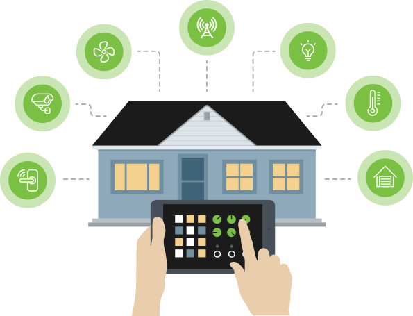
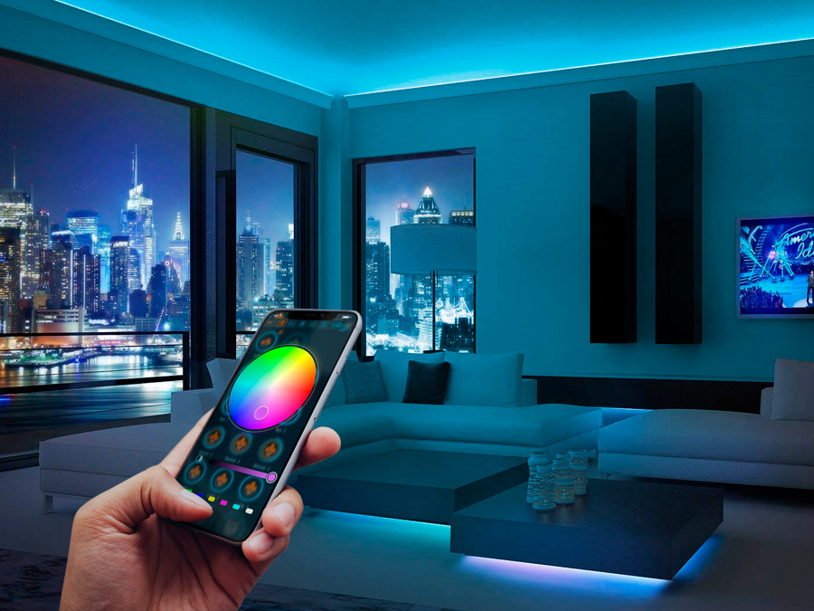
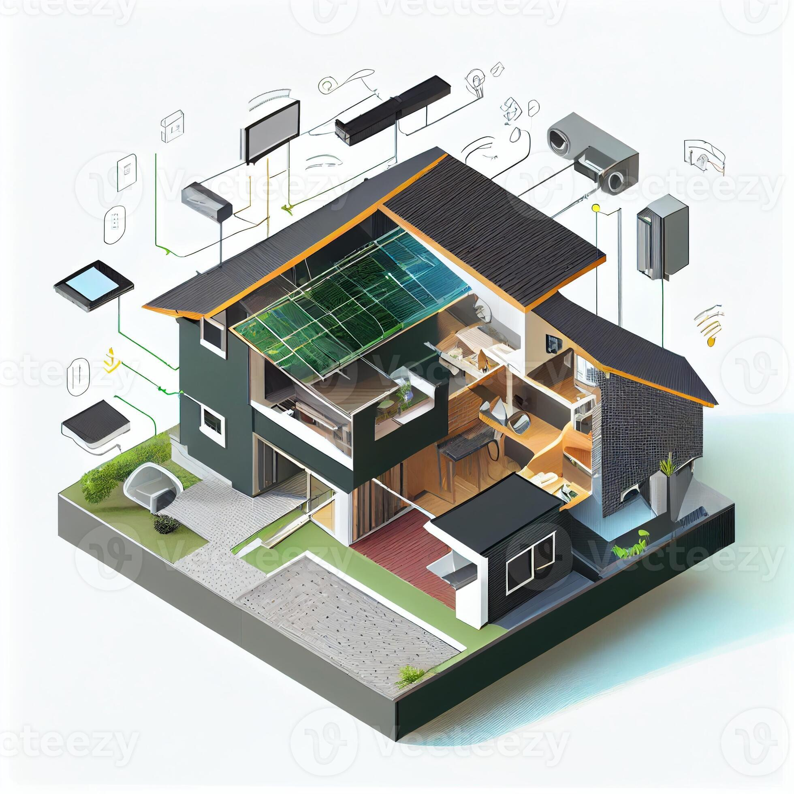
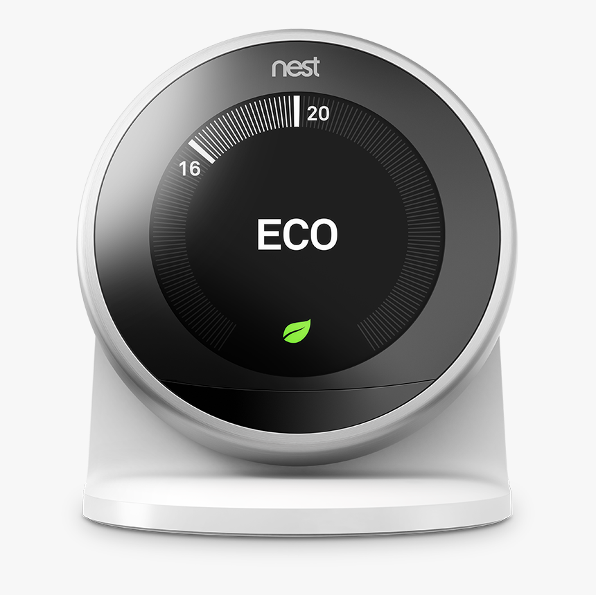
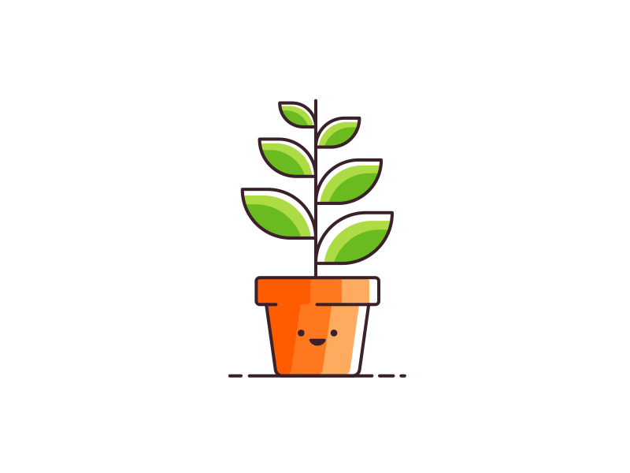

<!DOCTYPE html>

<head>

<title>SMART HOME</title>

<link rel="stylesheet" href="smart.css" media="screen">

</head>

<body> <header>

<ing class="src="beb.png">

<ul>

<li><a>Home</a></li>

<li><a>About</a></li>

<li><a>Accesss Control</a></li>

<li><a>Digital</a></li>

</ul>

<form>

<input type="search" name="p" placeholder "Search">

</form>

</header>

</body>

<html> 
    
    

    
  Полный контроль над домом даже на расстоянии — можно выключить свет, проверить камеры, закрыть дверь или отключить утюг с телефона.
Автоматизация рутины — свет сам включается вечером, шторы открываются утром, кондиционер подстраивается под температуру. 
        
        

    
    Гибкие сценарии — один режим может менять сразу всё: освещение, музыку, температуру, технику. Например «Сон», «Кино», «Работа», «Я ушёл». Высокая вариативность устройств — можно комбинировать лампы, датчики, колонки, розетки, замки, камеры и делать систему под себя.
 

  

  
  
    Надёжность умного дома
Умный дом способен повысить безопасность и стабильность жизни в доме благодаря автоматическому контролю систем. Датчики могут обнаруживать утечки воды, газа, дым или проникновение в помещение и сразу уведомлять владельца. Многие устройства продолжают работать даже без постоянного участия человека, снижая вероятность забыть выключить свет, технику или закрыть дверь. При правильной настройке система делает дом более защищённым и удобным.
    

  Экологическая результативность умного дома
Умный дом помогает экономить ресурсы и уменьшать лишнее потребление энергии. Освещение и техника автоматически отключаются, когда они не нужны, а отопление и кондиционирование регулируются в зависимости от температуры и присутствия людей. Это снижает расход электричества и воды, что уменьшает нагрузку на окружающую среду. Благодаря автоматизации дом становится более энергоэффективным и экологичным.

  

</html>
<html>
    <table width="100%">
<tr>
             <td align="center">
                Пример работы:
        
            </td>
        </tr>
         </table>
        </html>

  <!-- Скрытый чекбокс, который хранит состояние -->
  <input type="checkbox" id="bg-switch" class="toggle-checkbox">
  
  <!-- Кнопка-тумблер -->
  <label for="bg-switch" class="toggle-label">
    
  </label>

  

    <h1>Включить свет</h1>
    
Нажми на переключатель выше!

  

    
